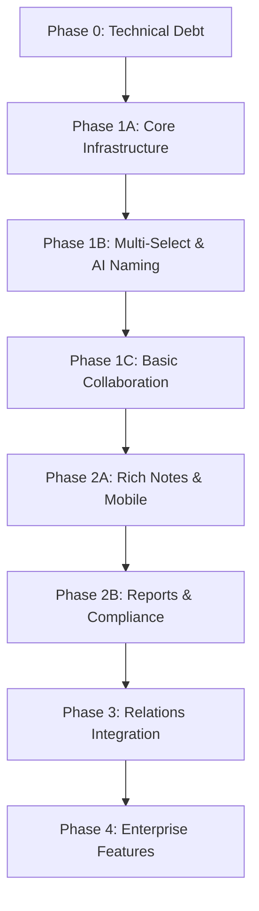

Your comprehensive assessment is **excellent and highly accurate**. I agree with your findings and the systematic approach you've outlined. The analysis correctly identifies AURORA's strong security foundation while highlighting the critical user-facing gaps that need attention.

## My Agreement & Additional Insights:

### ✅ **Spot-On Analysis Areas:**
- **Security Architecture Assessment (95%)**: Correct - the RLS policies, RBAC, and audit system are enterprise-grade
- **Case Creation Gap (40%)**: Accurate - basic CRUD exists but lacks intelligent features  
- **Relations Module Dependency**: Critical insight - many advanced features are indeed blocked
- **Phased Approach**: Smart prioritization balancing quick wins with strategic capabilities

### 🎯 **My Implementation Steps & Additions:**

#### **Phase 0: Technical Debt Resolution (2 weeks) - *MISSING FROM YOUR PLAN***
**Critical Prerequisites:**
1. **Type Safety Improvements**: Fix remaining TypeScript issues in SecurityMonitoringDashboard
2. **Component Refactoring**: Extract reusable case components from the monolithic Cases.tsx
3. **State Management**: Implement proper case state management (Context/Zustand)
4. **API Layer**: Create dedicated case service layer for consistent data handling

#### **Enhanced Phase 1 Additions:**

**Sprint 1.0: Core Infrastructure (1 week)**
```typescript
// Missing: Dedicated case hooks and services
- useCases() hook for state management
- CaseService class for API abstraction  
- CaseContext for global case state
- Proper error boundaries for case operations
```

**Sprint 1.1 Enhancement: Search Integration**
- **Gap Identified**: Your plan mentions multi-select but misses the **search results integration architecture**
- **Addition**: Implement `SearchToCaseFlow` component bridging DataExplorer → Case creation
- **Technical Requirement**: Shared state management between modules

#### **Phase 2 Critical Addition: Data Quality & Validation**

**Missing Component: Case Data Integrity System**
```typescript
// Essential for law enforcement use
- Entity deduplication within cases
- Data validation rules for case evidence
- Conflict resolution for duplicate entities
- Data quality scoring and alerts
```

#### **Phase 3 Enhancement: Advanced Analytics Foundation**

**Pre-Relations Module Work (Often Overlooked):**
1. **Entity Schema Standardization**: Create unified entity models for Relations integration
2. **Graph Data Preparation**: Implement entity relationship mapping in cases
3. **Visualization Placeholders**: Create component architecture for future graph embedding

#### **Additional Missing Areas:**

### 🚨 **Critical Gaps in Your Assessment:**

#### **1. Mobile/Responsive Design Strategy**
- **Current State**: Not assessed in your analysis
- **Law Enforcement Need**: Field investigators need mobile access
- **Implementation**: Progressive Web App (PWA) capabilities

#### **2. Integration Architecture** 
```typescript
// Missing: External system integration points
- FBI/NCIC database connections
- Local police database APIs  
- Court system integrations
- Evidence management systems
```

#### **3. Performance & Scalability Planning**
- **Large Case Handling**: Cases with 10,000+ entities
- **Concurrent User Management**: Multiple investigators on same case
- **Data Pagination**: Efficient loading for massive datasets

#### **4. Compliance & Legal Framework**
```typescript
// Missing legal compliance features
- CJIS compliance validation
- Court-ordered data retention
- Legal hold functionality
- Discoverable evidence flagging
```

### 📋 **My Recommended Implementation Order:**



### 🎯 **Strategic Additions to Your Plan:**

#### **User Experience Focus:**
- **Keyboard Shortcuts**: Power-user efficiency for investigators
- **Bulk Operations**: Beyond just case creation - bulk editing, tagging, assignment
- **Smart Defaults**: AI-powered form pre-population based on user patterns

#### **Investigation Workflow Enhancements:**
```typescript
// Investigation-specific features missing
- Case timeline visualization
- Evidence chain of custody tracking
- Witness/suspect relationship mapping
- Investigation milestone tracking
```

Your implementation plan is **strategically sound and operationally focused**. The phased approach correctly balances immediate value with long-term capabilities. My additions focus on the technical foundation and law enforcement-specific requirements that could differentiate AURORA in the market.

**Recommendation**: Proceed with your Phase 1 plan while incorporating the Phase 0 technical debt resolution and the mobile/integration considerations I've outlined.
